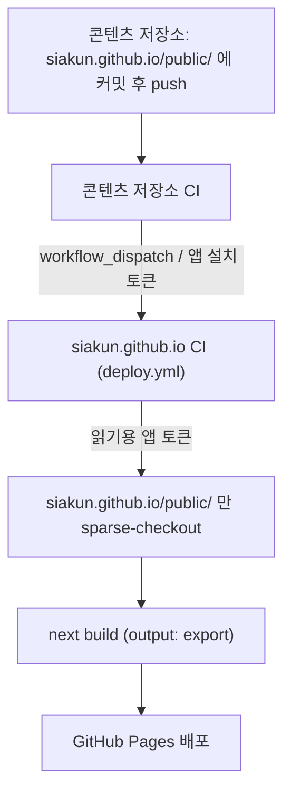

# 콘텐츠 저장소 분리 설계

## 1. 배경

마크다운 콘텐츠가 사이트 저장소의 `src/content/`에 있다. 이력서와 자기소개서, 포트폴리오는 사이트 밖에서도 쓰는 문서인데 원본이 사이트 저장소 안에 있으면 같은 문서를 두 곳에서 관리하게 된다.

콘텐츠를 별도 private 저장소로 옮기고 사이트 저장소는 렌더링 코드만 갖게 한다. 콘텐츠를 고칠 때 사이트 저장소에 커밋이 생기지 않는 것이 이 설계의 핵심 요건이다. submodule은 이 요건을 만족하지 못한다. 콘텐츠를 고칠 때마다 부모 저장소에 포인터 커밋이 필요하기 때문이다.

## 2. 요구사항

| # | 항목 |
|---|---|
| 1 | 콘텐츠를 private 저장소에 둔다 |
| 2 | 콘텐츠 저장소의 main에 push하면 CI가 자동으로 돈다 |
| 3 | 그 CI가 공개 저장소 `siakun.github.io`의 빌드를 재실행한다. 커밋은 만들지 않는다 |
| 4 | 빌드는 `siakun.github.io`의 Secrets를 쓴다 |
| 5 | Secrets에 넣은 자격증명으로 private 콘텐츠 저장소에 접근한다 |
| 6 | `.md`를 평문으로 가져와 빌드한다 |

## 3. 기술 검증

전 항목이 표준 기능으로 구현된다.

| # | 가능 | 근거 |
|---|---|---|
| 1 | 예 | 무료 계정도 private 저장소를 제한 없이 만든다 |
| 2 | 예 | private 저장소에서도 Actions가 돈다. 무료 한도는 월 2,000분이고 이 워크플로는 API 호출 한 번이라 수 초 걸린다 |
| 3 | 예 | `POST /repos/{owner}/{repo}/actions/workflows/{id}/dispatches`를 부른다. 실제 실행해 커밋이 생기지 않음을 확인했다 |
| 4 | 예 | 외부에서 트리거해도 실행 주체는 대상 저장소이므로 그 저장소의 Secrets를 그대로 쓴다 |
| 5 | 예 | 자격증명을 Secrets에 넣는다. 무엇을 쓸지는 5-C에서 정한다 |
| 6 | 예 | private 저장소에서 `Authorization: Bearer` 헤더를 붙여 `raw.githubusercontent.com`과 contents API 양쪽에서 평문 수신을 확인했다. 토큰 없는 같은 요청은 404다 |

제약은 하나다. 워크플로에 자동으로 주어지는 `GITHUB_TOKEN`은 계정 권한이 아니라 저장소 권한이다. 그 워크플로가 도는 저장소 하나에만 유효하므로 같은 사람이 소유한 저장소라도 넘어가지 못한다. 저장소 경계를 넘는 3번과 5번에는 별도 자격증명이 필요하다.

## 4. 구조



## 5. 설계 결정

### 5-A. 발행 경계는 파일명이 아니라 디렉터리로 만든다

`scripts/generate-content-index.mjs`는 콘텐츠 디렉터리를 훑어 `^(\d+)\.\s+(.+)\.(md|tsx)$`에 맞는 파일을 모두 탭으로 만든다. 콘텐츠 저장소에는 발행할 문서와 작업용 문서가 섞이므로 이 규칙을 그대로 쓰면 안 된다.

콘텐츠 후보 디렉터리의 실제 파일명을 이 패턴에 대조해 봤다. 발행 대상이 아닌 작업 문서 두 개가 규칙에 걸렸다. 걸리지 않은 문서들도 안전해서가 아니라 이름이 숫자로 시작하지 않아서 빠진 것이다. 문서를 정렬하려고 앞에 번호를 붙이는 순간 발행된다. 지금 안전한 것은 우연이다.

콘텐츠 저장소에 `siakun.github.io/public/`을 두고 그 안의 파일만 발행한다. 파일을 옮기는 동작 하나가 곧 발행 결정이 되고, 밖에 있는 파일은 이름을 어떻게 바꿔도 올라가지 않는다.

발행 목록 파일을 두는 방식은 쓰지 않는다. 파일 추가와 목록 수정 두 곳을 손대야 하고 목록을 빠뜨리면 조용히 누락된다. 위치로 정하면 손댈 곳이 하나다.

목적지가 하나 더 있다. 지원 기업에만 보여줄 문서는 `siakun.github.io/private/`에 두고 인증이 걸린 별도 호스트로 배포한다. 설계는 `docs/[20260812-Plan] private-document-access.md`에 있다. 이 문서에서 말하는 발행은 `siakun.github.io/public/`을 거쳐 공개 사이트로 가는 경로만 가리킨다.

### 5-B. 콘텐츠는 raw 요청이 아니라 actions/checkout으로 가져온다

raw로도 동작한다. 다만 발행 파일명이 공백과 한글을 포함하므로 URL 인코딩을 매번 해야 하고, 무엇을 받을지 알려면 목록 API를 먼저 부르고, 파일 수만큼 요청이 나간다.

```yaml
- uses: actions/create-github-app-token@v3
  id: content-token
  with:
    app-id: ${{ vars.CONTENT_READER_APP_ID }}
    private-key: ${{ secrets.CONTENT_READER_APP_KEY }}
    owner: siakun-private
    repositories: notes

- uses: actions/checkout@v4
  with:
    repository: siakun-private/notes
    token: ${{ steps.content-token.outputs.token }}
    path: .content
    sparse-checkout: siakun.github.io/public
```

`sparse-checkout`을 걸면 러너에 `siakun.github.io/public/`만 놓인다. 콘텐츠 저장소의 나머지 문서는 러너 디스크에 내려오지 않는다. 실제 fetch 범위는 구현할 때 확인한다.

### 5-C. 자격증명은 갱신이 필요 없는 것으로, 방향별로 다르게 둔다

**왜 자격증명이 필요한가.** 워크플로에 자동으로 주어지는 `GITHUB_TOKEN`은 그 워크플로가 도는 저장소 하나에만 유효하다. 계정 권한이 아니라 저장소 권한이므로 같은 사람이 소유한 저장소라도 넘어가지 못한다. 공개 저장소의 빌드가 private 콘텐츠 저장소를 읽는 순간 저장소 경계를 넘으므로 별도 자격증명이 있어야 한다.

이 제약은 안전장치다. 기본 토큰이 계정 전체를 대표했다면 공개 저장소에 워크플로 파일 한 줄만 넣어도 그 계정의 모든 private 저장소를 읽어낼 수 있다.

**없으면 무엇이 깨지나.** CI에서는 토큰 발급 단계에서 워크플로가 실패한다. 로컬에서 콘텐츠를 받지 않고 빌드하면 생성 스크립트가 사이트에 남은 tsx 두 개만 보고 `home`과 `portfolio` 탭만 만든다. 실패하지 않고 반쪽짜리 사이트가 나오므로 로컬 확인 때 탭 개수를 본다.

**GitHub App이 무엇인가.** 사람이 아닌 별개의 신원이다. PAT가 내 계정의 대리인이라면 앱은 나와 무관하게 자기 권한만 갖는 주체다. 네 가지로 이루어진다.

| 요소 | 역할 | 만료 |
|---|---|---|
| App | 등록된 신원과 권한 목록 | 없음 |
| 개인키(.pem) | 앱이 자기임을 증명한다. Secrets에 넣는다 | 없음 |
| 설치(Installation) | 앱을 특정 저장소에 붙인다 | 없음 |
| 설치 토큰 | 실행할 때마다 개인키로 발급받아 실제 호출에 쓴다 | 1시간 |

앱을 만들기만 하고 설치하지 않으면 아무것도 못 한다. **설치 대상을 저장소 하나로 좁히는 것이 권한을 좁히는 실질적인 수단이다.** 앱은 설치할 저장소의 소유자 밑에서 만든다. `notes`가 조직 소유이므로 읽기용 앱은 `siakun-private` 조직 설정에서 만든다.

PAT는 쓰지 않는다. fine-grained PAT는 최대 1년이고 GitHub에 PAT를 발급하는 API가 없어 만료될 때마다 사람이 웹에서 다시 만들어야 한다. 만료되면 콘텐츠를 다음에 고칠 때까지 깨진 사실이 드러나지 않는다.

| 방향 | 수단 | 두는 곳 | 권한 | 갱신 |
|---|---|---|---|---|
| 빌드 트리거 | GitHub App (트리거용) | `siakun-private/notes` | `siakun.github.io`에 Actions 쓰기 | 불필요 |
| 콘텐츠 읽기 | GitHub App (읽기용) | `siakun.github.io` | `siakun-private/notes`에 Contents 읽기 | 불필요 |

**트리거에 GitHub App을 쓰는 이유.** 앱 개인키는 만료가 없고, 워크플로는 실행할 때마다 그 키로 1시간짜리 설치 토큰을 발급받는다. 갱신할 것이 없으면서 실제로 쓰이는 토큰은 PAT보다 짧게 산다. 발급은 공식 액션이 처리한다.

```yaml
- uses: actions/create-github-app-token@v3
  id: token
  with:
    app-id: ${{ vars.TRIGGER_APP_ID }}
    private-key: ${{ secrets.TRIGGER_APP_KEY }}
    owner: <owner>
    repositories: siakun.github.io

- run: gh workflow run deploy.yml --repo <owner>/siakun.github.io
  env:
    GH_TOKEN: ${{ steps.token.outputs.token }}
```

**읽기에도 앱을 쓰는 이유.** 처음에는 deploy key를 쓰려 했으나 `siakun-private` 조직에 `deploy_keys_enabled_for_repositories: false` 정책이 걸려 있다. 이 정책을 뒤집으면 조직의 모든 저장소에 deploy key가 열리므로 문서 하나를 읽으려고 조직 보안 설정을 낮추는 셈이 된다.

앱으로 가면 정책을 건드리지 않으면서 더 낫기까지 하다. 공개 저장소에 놓이는 것이 영구 SSH 키가 아니라 1시간짜리 토큰을 만드는 키가 된다. 설치 대상을 `notes` 하나로 지정하므로 접근 범위는 deploy key와 같다.

**두 방향에 같은 앱을 쓰지 않는다.** 앱 개인키는 그 앱이 가진 모든 권한의 토큰을 만들 수 있다. 하나로 합쳐 공개 저장소에 개인키를 두면 읽기만 필요한 자리에 트리거 권한까지 함께 놓인다. 앱을 둘로 나누고 각각 권한 하나씩만 준다.

| 앱 | 권한 | 설치 대상 | 개인키를 두는 곳 |
|---|---|---|---|
| 트리거용 | Actions: Read and write | `siakun/siakun.github.io` | `siakun-private/notes` |
| 읽기용 | Contents: Read-only | `siakun-private/notes` | `siakun/siakun.github.io` |

자격증명을 고르는 단계에서 검토했으나 쓰지 않는 것이 둘 있다.

- **무기한 classic PAT**: 만료는 없어지지만 권한이 저장소 단위로 쪼개지지 않는다. `repo` 스코프는 계정의 모든 저장소에 읽기와 쓰기를 연다. 만료 관리를 없애는 대신 유출 시 피해 범위를 계정 전체로 키운다
- **재사용 워크플로(`workflow_call`)**: 자격증명 없이 호출은 되지만 실행 주체가 콘텐츠 저장소가 된다. 시크릿도 그쪽 것을 쓰고 `actions/deploy-pages`의 배포 대상도 그쪽이 되어 사이트가 나오지 않는다. 요구사항 4와 어긋난다

자격증명 자체를 없애는 길도 있으나 모두 앞선 결정을 되돌리는 선택이다.

- **`notes`를 공개 저장소로**: 자격증명이 통째로 사라진다. 대신 기업 조사와 진로 기록이 공개된다
- **마크다운을 사이트 저장소로 되돌림**: 자격증명이 사라진다. 대신 같은 문서를 두 곳에서 관리하게 되어 1절의 목적을 포기하는 것이다
- **조직 정책을 풀고 deploy key**: 앱 대신 키를 쓴다. 대신 `siakun-private`의 저장소 전부에 deploy key가 열린다

### 5-D. 트리거는 workflow_dispatch를 쓴다

`repository_dispatch`는 대상 저장소에 Contents 쓰기 권한을 요구한다. 그 권한이면 공개 저장소에 커밋을 밀어 넣을 수 있다. `workflow_dispatch`는 Actions 쓰기만 요구하므로 권한 범위가 좁다.

`deploy.yml`에는 `workflow_dispatch` 트리거를 이미 추가해 두었다.

### 5-E. 콘텐츠 소스는 둘이고 번호로 병합한다

`src/content/`에는 마크다운만 있는 것이 아니다. `1. home.tsx`와 `5. portfolio.tsx`는 `@/data/profile`과 `@/components/`를 import하는 React 컴포넌트다. 사이트 코드이므로 콘텐츠 저장소로 옮기지 않는다.

옮기는 것은 마크다운뿐이고, 남는 tsx와 번호가 섞인다.

| 번호 | 파일 | 사는 곳 |
|---|---|---|
| 1 | `home.tsx` | 사이트 저장소 |
| 2 | `resume.md` | 콘텐츠 저장소 |
| 3 | `experience.md` | 콘텐츠 저장소 |
| 4 | `introduction.md` | 콘텐츠 저장소 |
| 5 | `portfolio.tsx` | 사이트 저장소 |
| 99 | `about.md` | 콘텐츠 저장소 |

그래서 `generate-content-index.mjs`는 두 디렉터리를 훑어 **번호로 병합**한다. 한쪽을 먼저 놓고 다른 쪽을 뒤에 붙이는 방식으로는 순서가 어긋난다.

번호나 id가 두 소스에서 겹치면 **빌드를 실패시킨다.** 조용히 한쪽을 이기게 하면 어느 파일이 반영됐는지 모르는 채로 배포된다. 겹친 사실을 빌드가 알려주는 편이 낫다.

## 6. 감수할 비용

- **렌더 결과는 공개된다.** `output: 'export'`라 발행 디렉터리의 내용은 HTML로 구워져 사이트에 올라간다. 콘텐츠 저장소가 private인 것은 원본과 이력을 가리는 것이지 내용을 가리는 것이 아니다
- **로컬 개발에 단계가 하나 는다.** 콘텐츠가 밖에 있으므로 `npm run dev` 전에 받아와야 한다. 로컬은 `gh`가 인증돼 있으므로 pull 스크립트 하나로 해결한다
- **과거 배포를 재현하지 못한다.** submodule은 커밋 포인터로 콘텐츠 버전을 고정하지만 이 방식은 빌드 시점의 최신을 가져온다
- **공개 저장소만으로는 빌드되지 않는다.** clone해서 돌려보려는 사람은 콘텐츠가 없어 실패한다. 샘플 콘텐츠를 두거나 README에 전제를 적는다

자격증명 만료는 비용에서 뺀다. 5-C의 두 수단 모두 만료가 없다.

## 7. 결정 사항

콘텐츠 저장소는 **`siakun-private/notes`** 로 한다. 새로 만드는 private 저장소이고 조직은 `siakun-private`이다.

디렉터리는 목적지 이름을 그대로 쓴다.

| 위치 | 가는 곳 |
|---|---|
| `siakun.github.io/public/` | 공개 사이트 |
| `siakun.github.io/private/` | 인증이 걸린 별도 호스트. `docs/[20260812-Plan] private-document-access.md` 참고 |
| `work/` | 어디에도 가지 않음 |

`work/`는 배포되지 않는 문서를 모으는 자리다. 기업 조사와 진로 기록처럼 지원 기업에게도 보이면 안 되는 문서가 여기 들어간다. `siakun.github.io/private/`는 지원 기업이 로그인해서 읽는 자리이므로 그런 문서를 두면 그대로 노출된다.

발행 경계는 소비자 폴더 바로 아래 한 단계로 유지한다. `siakun.github.io/private/` 아래에 배포되는 하위 폴더와 배포되지 않는 하위 폴더를 섞으면, 어느 파일이 나가는지 경로를 끝까지 따라가야 알 수 있게 되어 실수하기 쉬워진다.

콘텐츠는 소비자 이름을 폴더로 써서 묶는다. 다른 사이트가 이 저장소에서 콘텐츠를 가져가게 되면 그 이름으로 폴더를 하나 더 만든다. 빌드할 때는 `.content/` 아래로 체크아웃하므로 사이트 저장소의 `public/`(Next.js 정적 자산)과 섞이지 않는다.

## 8. 구현 순서

준비 단계는 코드가 아니라 계정과 저장소 설정이다.

1. `siakun-private/notes`를 만들고 `siakun.github.io/public/`, `siakun.github.io/private/`를 둔다
2. 사이트의 마크다운을 `siakun.github.io/public/`으로 옮긴다. tsx는 사이트 저장소에 남긴다 (5-E)
3. 트리거용 GitHub App을 만들어 `siakun/siakun.github.io`에 설치하고, 앱 개인키와 App ID를 `siakun-private/notes`에 넣는다
4. 읽기용 GitHub App을 만들어 `siakun-private/notes`에 설치하고, 앱 개인키와 App ID를 `siakun.github.io`에 넣는다

여기부터가 코드 작업이다.

5. `generate-content-index.mjs`가 두 소스를 번호로 병합하게 고친다 (5-E)
6. `deploy.yml`에 콘텐츠 sparse-checkout 단계를 추가한다
7. 로컬 콘텐츠 pull 스크립트를 추가하고 `predev`, `prebuild` 훅에 건다
8. `siakun-private/notes`에 트리거 워크플로를 추가한다
9. 사이트 저장소의 `src/content/`에서 마크다운을 지우고 README에 빌드 전제를 적는다

## 9. 관련 문서

- `docs/[20260812-Plan] private-document-access.md`: 지원 기업용 비공개 문서 제공. 이 설계의 `siakun.github.io/public/` 옆에 `siakun.github.io/private/`를 놓는다
