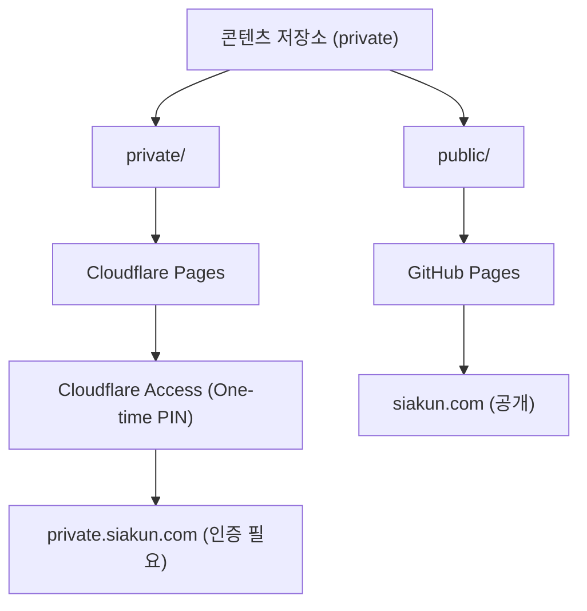

# 지원 기업용 비공개 문서 제공 설계

## 1. 배경

회사별 자기소개서처럼 특정 지원 기업에만 보여줄 문서가 있다. 공개 포트폴리오에 올릴 수는 없고, 그렇다고 매번 파일을 첨부해 보내면 관리가 흩어진다. 콘텐츠 저장소에서 함께 관리하되 접근만 통제하는 경로를 만든다.

콘텐츠 저장소 자체의 분리는 `docs/[20260809-Plan] content-repo-separation.md`에서 다룬다. 이 문서는 그 위에 얹는 비공개 전달 경로만 다룬다.

## 2. 요구사항

| # | 항목 |
|---|---|
| 1 | 담당자가 계정을 만들지 않고 링크로 들어온다 |
| 2 | 공개 사이트와 검색엔진에 노출되지 않는다 |
| 3 | 전달한 뒤에도 접근을 회수할 수 있다 |
| 4 | 누가 언제 열었는지 확인할 수 있다 |

전제가 하나 있다. 이 설계는 도메인이 Cloudflare에서 관리되는 것에 의존한다. 도메인 관리처를 옮기면 이 설계도 함께 옮겨야 한다.

## 3. 채택하지 않은 방안: 정적 사이트 클라이언트 암호화

공개 사이트에 암호문을 올리고 방문자가 암호를 입력하면 브라우저가 복호화하는 방식을 먼저 검토했다. 서버 없이 되는 방식이지만 요구사항 3번과 4번을 만족하지 못해 접었다.

- **회수가 안 된다.** 코드를 바꾸면 새 암호문은 못 풀지만 이미 받아간 암호문은 옛 코드로 계속 풀린다
- **누가 봤는지 모른다.** 서버가 없으니 접근 기록이 남지 않는다
- **암호문이 영구히 공개된다.** 나중에 내려도 받아간 사람에게는 남는다
- **시도 횟수를 못 막는다.** 상대가 자기 컴퓨터에서 무제한으로 대입한다. 짧은 PIN은 즉시 뚫린다

검토 중에 나온 오해를 기록해 둔다. 비대칭 키로 "개인키로 암호화하고 공개키로 푼다"는 구성은 **서명이지 암호화가 아니다.** 공개키는 공개돼 있으므로 누구나 복호화한다. 기밀성이 필요하면 공개키로 걸고 개인키로 푼다.

방향을 바로잡아도 정적 사이트에서는 성립하지 않는다. 방문자 브라우저가 문서를 그리려면 브라우저가 복호화해야 하고, 그러려면 키가 브라우저까지 가야 한다. 키가 브라우저에 가는 순간 공개된 것이다. 서버가 없는 한 이 구조는 바뀌지 않는다.

## 4. 채택: Cloudflare Access

Cloudflare 엣지가 인증을 처리하므로 인증 전에는 본문이 아예 나가지 않는다. 3절의 네 가지 한계가 모두 해소된다.

| | 클라이언트 암호화 | Cloudflare Access |
|---|---|---|
| 인증 전에 나가는 것 | 암호문 전체 | 없음 |
| 회수 | 불가 | 정책에서 빼면 즉시 |
| 접근 기록 | 없음 | 남음 |
| 무차별 대입 | 오프라인 무제한 | 서버가 막음 |
| 비용 | 없음 | Zero Trust 무료 등급 범위 내 |

## 5. 구조

| 호스트 | 용도 | 배포 |
|---|---|---|
| `siakun.com` | 공개 포트폴리오 | GitHub Pages |
| `private.siakun.com` | 지원 기업용 문서 | Cloudflare Pages + Access |

콘텐츠 저장소의 디렉터리가 목적지를 정한다.

| 위치 | 가는 곳 |
|---|---|
| `public/` | `siakun.com` |
| `private/` | `private.siakun.com` |
| 그 밖 | 어디에도 가지 않음 |

## 6. 설계 결정

### 6-A. private 문서는 공개 저장소의 빌드에 넣지 않는다

Access는 Cloudflare를 지나는 경로만 지킨다. 같은 파일이 다른 경로로도 닿으면 그쪽으로 새 나간다.

공개 저장소의 빌드에 private 문서를 넣으면 우회로가 둘 생긴다. GitHub Pages 오리진이 같은 파일을 그대로 들고 있고, 공개 저장소의 Actions 산출물에도 들어간다. 현관에만 자물쇠를 달고 뒷문을 열어두는 셈이다.

그래서 `private/`는 공개 사이트 빌드에서 제외하고, Cloudflare Pages가 콘텐츠 저장소에서 직접 빌드한다. Cloudflare Pages는 private GitHub 저장소에 연결할 수 있다.

### 6-B. 인증은 One-time PIN을 쓴다

담당자가 메일 주소를 넣으면 6자리 코드가 메일로 온다. 계정을 만들지 않아도 되므로 요구사항 1번을 만족한다.

코드가 6자리로 짧아도 안전하다. 서버가 검증하므로 시도 횟수 제한과 만료가 걸린다. 3절에서 접은 방식이 긴 코드를 요구했던 이유는 서버가 없어 대입을 막지 못했기 때문이다.

### 6-C. 정책은 회사 도메인 단위를 우선한다

개별 메일 주소로 좁히면 담당자가 바뀔 때마다 정책을 고쳐야 한다. `@회사도메인` 단위로 열면 그 회사 안에서 알아서 돌아간다. 개인 메일로 절차가 진행되는 경우에만 개별 주소를 추가한다.

### 6-D. 검색엔진 노출은 Access가 막는다

크롤러도 인증 전 요청이므로 본문에 닿지 못한다. 별도 `noindex`는 보조 수단이다. `private.siakun.com`을 공개 사이트 sitemap에 넣지 않는다.

## 7. 감수할 비용

- **배포 경로가 둘로 늘어난다.** 공개 사이트와 비공개 사이트를 각각 빌드한다
- **담당자 쪽에서 문의가 생길 수 있다.** 인증 메일이 스팸함으로 가거나 회사 메일 정책에 막히는 경우가 있다
- **Cloudflare에 의존한다.** 도메인 관리처를 옮기면 이 설계도 옮겨야 한다
- **무료 등급에 사용자 수 상한이 있다.** 지원 기업 수를 생각하면 여유가 있으나 상한이 있다는 사실은 알고 쓴다

## 8. 미결 사항

- **공개 사이트를 어디에 둘지.** GitHub Pages에 그대로 두기를 권한다. 지금 잘 돌고 있고 공개 사이트에는 Access가 필요 없다. Cloudflare Pages로 옮기면 연결된 저장소에 push가 올 때 알아서 다시 빌드하므로 별도 트리거가 필요 없어지는 이점이 있으나, 그 이점은 콘텐츠 저장소를 연결했을 때 생기는 것이라 공개 사이트만 옮겨서는 얻지 못한다

콘텐츠 저장소는 `siakun-private/notes`로 정해졌다. `docs/[20260809-Plan] content-repo-separation.md` 7절을 참고한다.

## 9. 구현 순서

1. `siakun.com`을 GitHub Pages 커스텀 도메인으로 연결한다
2. 콘텐츠 저장소에 `private/`를 만든다
3. Cloudflare Pages 프로젝트를 콘텐츠 저장소에 연결하고 `private.siakun.com`으로 배포한다
4. Zero Trust에서 Access 애플리케이션을 만들고 One-time PIN 정책을 건다
5. 인증하지 않은 상태로 접근해 본문이 나오지 않는지 확인한다
6. 공개 사이트 산출물에 `private/` 문서가 섞이지 않았는지 확인한다

## 10. 관련 문서

- `docs/[20260809-Plan] content-repo-separation.md`: 콘텐츠 저장소 분리. 이 문서의 `private/`는 그 설계의 `public/`과 나란히 놓인다
